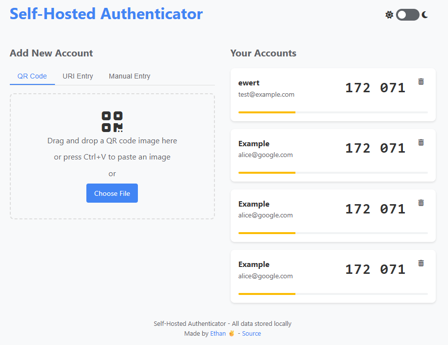
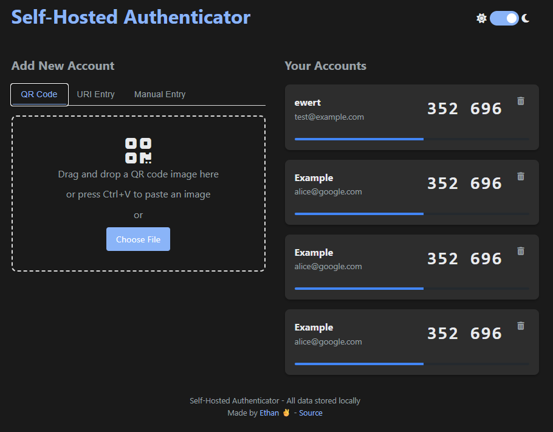
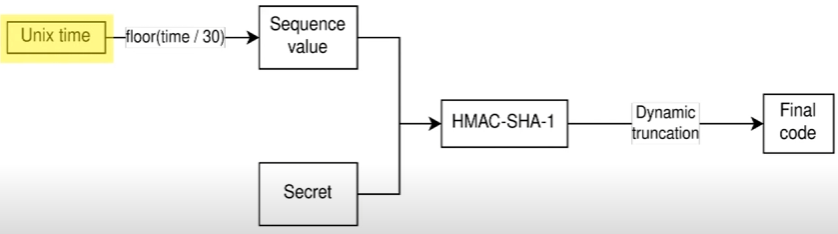

# Self-Hosted Authenticator

A simple, secure, self-hosted TOTP (Time-based One-Time Password) authenticator web app. This app provides functionality similar to Google Authenticator or Microsoft Authenticator but runs locally on your machine as a Docker container.

## Screenshots

<div align="center">
  <table>
    <tr>
      <td align="center"><strong>Light Mode</strong></td>
      <td align="center"><strong>Dark Mode</strong></td>
    </tr>
    <tr>
      <td></td>
      <td></td>
    </tr>
  </table>
</div>

## Features

- Add authentication secrets via QR code upload or manual URI input
- Securely store authentication secrets with encryption
- Generate time-based codes with a 30-second refresh
- Clean, responsive UI
- Runs completely locally - your secrets never leave your machine
- Docker containerization for easy deployment

## Technical Details

- Node.js backend with Express
- Browser-based frontend using vanilla JavaScript
- TOTP generation using the `oathtool` CLI
- Secret encryption using `crypto-js`
- Data storage using SQLite (a reliable file-based database)
- QR code processing with `jsQR` libraries
- Docker for containerization
- Light and dark mode support

## Prerequisites

- For Docker installation:
  - Docker and Docker Compose
  - Supports Windows, macOS, and Linux environments
- For manual installation:
  - Node.js (v14 or higher)
  - npm (v6 or higher)
  - `oathtool` package installed on your system

## Installation

### Option 1: Docker Installation (Recommended)

1. Clone this repository:
   ```
   git clone https://github.com/ethannguyen2k/self-hosted-totp-auth.git
   cd self-hosted-totp-auth
   ```

2. Configure the encryption key:
   Edit `docker-compose.yml` and change the `ENCRYPTION_KEY` environment variable to a secure random string:
   ```yaml
   environment:
     - NODE_ENV=production
     - ENCRYPTION_KEY=YourSecureRandomStringHere
   ```

3. Build and start the container:
   ```
   docker compose up -d
   ```

4. Access the authenticator:
   Open your browser and navigate to `http://localhost:3000`
   Or accessible on your local network at `http://<your-IP-address>:3000`

### Option 2: Manual Installation

1. Clone this repository:
   ```
   git clone https://github.com/ethannguyen2k/self-hosted-totp-auth.git
   cd self-hosted-totp-auth
   ```

2. Install dependencies:
   ```
   npm install
   ```

3. Install oathtool (if not already installed):
   - On Debian/Ubuntu: `sudo apt-get install oathtool`
   - On CentOS/RHEL: `sudo yum install oath-toolkit`
   - On macOS: `brew install oath-toolkit`
   - On Windows: Install through WSL or use a binary distribution

4. Create a .env file with your configuration:
   ```
   echo "NODE_ENV=production" > .env
   echo "ENCRYPTION_KEY=YourSecureRandomStringHere" >> .env
   echo "PORT=3000" >> .env
   ```

5. Start the application:
   ```
   npm start
   ```

6. Access the authenticator:
   Open your browser and navigate to `http://localhost:3000`

## Usage

### Adding a New Account

There are three ways to add a new authentication account:

1. **QR Code**:
   - Drag and drop a QR code image onto the drop area
   - Or click "Select file" to upload a QR code image
   - Or paste an image using Ctrl+V
   - Click "Scan Code" to extract and save the auth secret

2. **URI Entry**:
   - Switch to the "URI Entry" tab
   - Enter the full `otpauth://` URI
   - Click "Add Account"

3. **Manual Entry**:
   - Switch to the "Manual Entry" tab
   - Enter the service/issuer name (optional), account name, and secret key
   - Click "Add Account"

You can test by using this one-liner to generate a valid random Base32-encoded secret suitable for TOTP:
   ```
   openssl rand -base64 32 | base64 -d | base32 | tr -d '='
   ```

### Viewing Codes

Once accounts are added, they'll appear in the "Your Accounts" section with:
- The issuer and account name
- The current TOTP code
- A timer bar showing how much time is left before the code refreshes

### Removing Accounts

To remove an account, click the trash icon on the account card.

### Theme Customization

The application supports both light and dark themes:
- Toggle between themes using the switch in the header
- Your preference will be saved for future sessions
- By default, the app will respect your system's theme preference

## Security Considerations

- All secrets are encrypted before being stored
- Data is stored locally on your machine
- No data is sent to external servers
- For maximum security, run this on a trusted device on your local network
- Consider using a strong, unique encryption key
- Back up your database periodically

## Data Storage

The app stores data in the `./data` directory, which is mounted as a volume in the Docker container. This ensures data persistence across container restarts and updates.

### Database Backup

SQLite databases can be backed up easily with:
- The `.backup` command in SQLite
- Simply copying the `.db` file
- Note that when the database is in WAL mode (as in this application), you should back up all three files: `.db`, `.db-shm`, and `.db-wal`

## API & Debugging

The application provides several API endpoints to interact with the authenticator programmatically:

### API Endpoints

- `GET /api/accounts` - Lists all accounts (without secrets)
- `GET /api/accounts/:id/code` - Gets the current TOTP code for a specific account
- `POST /api/accounts/uri` - Adds a new account using an otpauth URI
- `POST /api/accounts/manual` - Adds a new account using manual details
- `DELETE /api/accounts/:id` - Removes an account

### Debug Endpoint

The application includes a debug endpoint that provides system diagnostics:

- `GET /api/debug` - Returns comprehensive system information including:
  - Node.js version and system details
  - Database statistics and connection status
  - Accounts summary (without revealing secrets)
  - File system information and permissions
  - Encryption key configuration status

You can use `http://<your-IP-address>:3000/api/debug` or `http://localhost:3000/api/debug`

## How TOTP Works

Time-based One-Time Password (TOTP) is an algorithm that generates a one-time password using:
1. A shared secret key
2. The current time (usually rounded to 30-second intervals)
3. A cryptographic hash function (typically HMAC-SHA1)

<div align="center">
  
</div>

The algorithm:
1. Takes the current Unix time and divides it by the time step (30 seconds)
2. Uses this value and the secret key with HMAC-SHA1 to generate a hash
3. Truncates the hash to get a 6-8 digit code

Your authenticator app and the server both perform this calculation with the same shared secret, producing identical codes for authentication.
You can see a video succint the information [here](https://youtu.be/46AKWNOJ3-Y?si=yZMa_-i1meclzkFG).

## License

[MIT License](LICENSE)

## Contributing

Contributions are welcome! Here's how you can contribute:

1. Fork the repository
2. Create a feature branch: `git checkout -b feature/my-new-feature`
3. Commit your changes: `git commit -am 'Add some feature'`
4. Push to the branch: `git push origin feature/my-new-feature`
5. Submit a pull request

### Development Setup

For development:

```
npm install
npm run dev  # Starts the server with nodemon for auto-reloading
```

Please make sure to update tests as appropriate and follow the existing code style.
